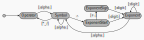

# Input and Output

In Dim, "input and output" is used to mean deserialization and serialization from text. 

## High-level I/O
Serialization and deserialization can be performed with stream operators, `to_string()`/`from_string()`,
and `std::format()`. For example
```cpp
si::Mass stuff = 2.0 * si::pound_mass;
std::cout << "The stuff masses " << stuff << "\n"; // "The stuff masses 4.41_kg"
std::string input = "3.5_kg";
std::from_string(stuff, input);
std::cout << std::format("The new mass is {:1}\n", stuff); // "The new mass is 4.4_kg"
```
Dim uses a custom locale facet to store formatting information for these functions. You can install 
and adjust the locale like this:
```cpp
#include <dim/si.hpp>
namespace si = ::dim::si;

int main(int argc, char** argv)
{
    // Let's format angles as degrees
    auto* facet = si::system::make_default_facet(); // obtain the default si facet    
    si::formatter<si::Angle> degree_formatter("deg", si::degree);
    facet->output_formatter(degree_formatter); // Set a new output format for angles    
    si::add_to_global_locale(facet); // Install the updated facet in the global locale
    
    si::Angle angle = M_PI*0.5 * si::radian;    
    std::cout << "Angle is " << angle << "\n"; // "Angle is 90_deg"
    return 0;
}
```
Formatters are discussed below.

## Formatters
Input/output in Dim rests on the `formatter` class. The formatter is a simple class that associates 
a string "symbol" with information on how to nondimensionalize a quantity. For example
```cpp
si::formatter degree_formatter("deg", si::degree);
```
will format angles as degrees. The first argument is the symbol string ("deg"), and the second argument gives
what you would multiply 1.0 by to obtain a quantity of the indicated symbol (`si::degree`).  There's
an optional third argument that is used for temperature conversion as an additive offset:
```cpp
si::formatter fahrenheit_format("F", 5./9.*kelvin, 255.37*kelvin);
```

Formatters provide `input` and `output` methods.  Input takes the form
```cpp
si::Angle x = degree_formatter.input<si::Angle>(90.0);
```
while output is
```
si::formatted_quantity<double> fmt = degree_formatter.output(2_rad);
```
The `formatted_quantity` divides the output into a scalar (double) part `value()` and a `char const*` 
symbol part `symbol()`. This allows you to do
```cpp
printf("My angle is %g_%s\n", fmt.value(), fmt.symbol());
```
or put the result into structured XML, etc.  An overload for `operator<<` and `std::formatter` 
allows for interaction with `ostream` and `std::format`. For example:
```cpp
std::cout << "My angle is " << degree_formatter.output(2_rad) << "\n";
```


### Format Maps
The facet maintains a map from input type to symbol for each quantity type indexed by the symbol string.
If the input unit string is an exact match to a map entry, that formatter is used to parse
the quantity.  This provides a flexible system where you can provide formatters for whatever 
domain-specific conventions you work with.  Dim ships with format maps for many common quantities. These
are derived from the NIST suggestions. For instance, here's the default length map:
```cpp
    static const format_map<Length> s_known {
        {"in",   formatter<Length>("in", inch) },
        {"inch", formatter<Length>("inch", inch)},
        {"ft",   formatter<Length>("ft", foot)},
        {"foot", formatter<Length>("foot", foot)},
        {"yd",   formatter<Length>("yd", yard)},
        {"yard", formatter<Length>("yard", yard)},
        {"mi",   formatter<Length>("mi", mile)},
        {"mile", formatter<Length>("mile", mile)},
        {"nmi",  formatter<Length>("nmi", nautical_mile)},
        {"nautical_mile", formatter<Length>("nautical_mile", nautical_mile)}
    };
```
Note that "m" and related SI ("km", "mm", etc) units aren't included because they are handled by the fallback parser
below -- SI units are generally easy to parse. But suppose for your domain, you wanted to accept "feet" for 
"foot" and "nm" for nautical mile (yes, that's a symbol clash with nanometer -- but you know what your users 
expect).  You could add these to the facet via
```cpp
auto* facet = si::make_default_facet(); // obtain the default si facet    
facet->input_formatter(formatter<Length>("feet", foot));
facet->input_formatter(formatter<Length>("nm", nautical_mile));
si::install_facet(facet);
```
or you can use your map directly as shown below. Because the map is consulted
before the fallback parser is called, you've overridden the meaning of "nm" for
your program.

## Low Level I/O
Dim provides the functions
```cpp
template <class Q, DIM_IS_QUANTITY(Q)>
bool format_quantity(formatted_quantity<typename Q::scalar>& o_formatted, Q const& i_q,
                     output_format_map<typename Q::scalar, typename Q::system> const* i_out_map = nullptr)

template <class Q, DIM_IS_QUANTITY(Q)>
bool parse_quantity(Q& o_q, formatted_quantity<typename Q::scalar> const& i_formatted,
                    input_format_map<typename Q::scalar, typename Q::system> const& i_unit_map = get_default_format<Q>())
```
and related `dynamic_quantity` versions for fully-customizable formatting. The
default `i_out_map` argument disables the use of the output symbol map, while
the `i_unit_map` default argument obtains the default symbol map for `Q`
provided by Dim. These functions transform quantities into formatted quantitys
and vice-versa using collections of formatters called format maps. In fact, the
IO facet is really just a convenient storage place for these maps.

# Fallback IO

What happens if the facet doesn't exist in the locale, or if the facet doesn't have a formatter
for our case? Dim provides fallback options in these cases described below.

## Basic Format

A symbol is associated with each dimension in a system, so a unit symbol can be
reconstructed. This is correct, but it isn't usually very pretty. Thus suppose
we had a torque we wanted to print:
```cpp
si::Torque T = 3_N * 2_m / 1.2_rad;
std::cout << "Torque is " << T << "\n";
```
If there's no output formatter for `si::Torque`, the output will be "5_rad^-1_kg_m^2_s^-2".

## Parsing Quantities

Input is a different beast. Because Dim is strongly typed, we know the desired
quantity type.  The task is to verify that the input string can be parsed to a
matching dimension, then apply the conversion factor for that dimension to the
scalar part. 

When no input formatter matches a symbol, Dim falls back to a parser for SI
types.  This parser recognizes all of the SI prefixes and (almost all*) symbols
defined in NIST SP 811. It recognizes `_`, `*` as multiplication, `/` as
division, and `^` as exponentiation. Units and exponents may be grouped with
parentheses. The parser is case-sensitive (this is required by the SI notation).
Examples of parsed strings include
* μm_s^-2
* (MPa)^2/mol^(3)

*Dim does not support the symbol "a" for the are unit of area (as in "hectare").
This symbol leads to ambiguities.  Forms of the are other than the hectare
appear to be rare.


# Design of Serialization/Deserialization
## Serialized Quantities
A serialized quantity is a string of the form
```
<serialized scalar>[separator]<serialized unit>
```
Routines in Dim transform quantities and dynamic_quantities into
`formatted_quantity` types. These can then be streamed, turned into strings, or
used with `std::format`. Likewise, deserialization turns input streams
(istreams, strings, `char const*`, ...) back into `formatted_quantity` types.
Parsers then work on the `<serialized unit>` string to complete the conversion
back to `quantity`/`dynamic_quantity`.

`<serialized scalar>` is a string representing the "number part" of a quantity.
By default, Dim will deserialize this using `std::from_chars` if it is
available, falling back to `std::strtold` and casting the result to the scalar
type otherwise. You can override this behavior by specializing
`dim:parse_scalar<>`. For serializing, stream output will use `operator<<`,
`to_string` will use `std::to_string` while `std::formatter<Q>` will use
`std::formatter<scalar>`.

The `[separator]` is optional. It consists of one character of either ' ', '*',
or '\_'. When Dim serializes a quantity, it uses '\_' to match the way literals
appear in code.

The `<serialized unit>` is more involved. When using a serializer that is
locale-aware (`operator<<`, `std::format`, or `to_string`), the quantity facet's
`output_symbol_map` will be used to determine the output symbol first. If the
unit isn't in the map, serialization will fall back to be system's built-in
method. For `format_quantity`, the `output_symbol_map` is an optional argument.
If it isn't supplied or if the unit isn't in the map, it will likewise fall back
to the built-in method. The built in method itself may have a specialized symbol
for the unit. If so, that's used. Finally, if no other method has worked, the
unit will be output using the base dimensions in the form
```
dim0^exponent0dim1^exponent1...dim7^exponent7
```
If the exponent is zero, the associated dimension is not printed. The order of
dimensions (different from the internal order) represents roughly observed
practice:
1. Angle
2. Mass
3. Length
4. Temperature
5. Amount
6. Current
7. Luminosity
8. Time

When deserializing a unit string, Dim first must determine which portion of the
input is a unit string.  This is done using the following state machine:



A select set of UTF-8 (Greek characters, the degree, degree Fahrenheit, degree
Celsius, angstrom, kelvin, and ohm symbols) are also recognized as "alpha" class
characters. Parentheses are accepted and are checked for balancing. When
encountering other inputs, or when the state machine ends with an unterminated
UTF-8 character or unbalanced parentheses, the state becomes `kError`. Once
the string has been found, methods first consult the `input_symbol_map`. If
the string is in the map, then that formatter is used for the conversion. If
not, Dim falls back to using the system's parser. 


## Fallback Parser Symbols

Non ASCII symbols in UTF-8 symbols are recognized, including mu, capital omega,
the kelvin sign, and the ohm sign.  In each of these cases, ASCII equivalents
are also accepted as noted below.

| Prefix | Magnitude |
|--------|-----------|
| y      | 1e-24     |
| z      | 1e-21     |
| a      | 1e-18     |
| f      | 1e-15     |
| p      | 1e-12     |
| n      | 1e-9      |
| μ*     | 1e-6      |
| m      | 1e-3      |
| c      | 1e-2      |
| d      | 1e-1      |
| Y      | 1e24      |
| Z      | 1e21      |
| E      | 1e18      |
| P      | 1e15      |
| T      | 1e12      |
| G      | 1e9       |
| M      | 1e6       |
| k      | 1e3       |
| h      | 1e2       |
         
*"u" is also accepted

|Symbol|Name       |
|------|-----------|
| m    | meter     |
| s    | second    |
| rad  | radian    |
| g    | gram      |
| K*   | kelvin    |
| mol  | mole      |
| A    | ampere    |
| cd   | candela   |
| Hz   | hertz     |
| sr   | steradian |
| N    | newton    |
| Pa   | pascal    |
| J    | joule     |
| W    | watt      |
| C    | coulomb   |
| V    | volt      |
| F    | farad     |
| Ω**  | ohm       |
| S    | siemens   |
| Wb   | weber     |
| T    | tesla     |
| H    | henry     |
| Im   | lumen     |
| Ix   | lux       |
| Bq   | becquerel |
| Sv   | sievert   |
| kat  | katal     |
| L    | liter     |
| eV   | electron volt|
| bar  | bar       |
| --   | are***    |

*The kelvin sign (U+212A) is also accepted.

**"R" and the ohm sign (U+2126) are also accepted. 

***The are (symbol "a") has been excluded as it makes parsing the units string
ambiguous. (Is "Pa" a pascal or is it a petaare?)
