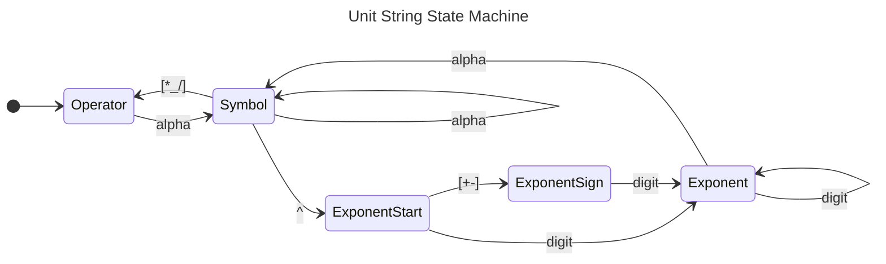

# Serialized Quantities
A serialized quantity is a string of the form
```
<serialized scalar>[separator]<serialized unit>
```
Routines in Dim transform quantities and dynamic_quantities into
`formatted_quantity` types. These can then be streamed, turned into strings, or
used with `std::format`. Likewise, deserialization turns input streams
(istreams, strings, `char const*`, ...) back into `formatted_quantiyy` types.
Parsers then work on the `<serialized unit>` string to complete the conversion
back to `quantity`/`dynamic_quantity`.

`<serialized scalar>` is a string representing the "number part" of a
quantity. The format is deterimined by the scalar type. By default, Dim will
deserialize this using `std::from_chars` if it is available, falling back to
casting the result of `std::strtold` if it is not. You can override this
behavior by TODO. For serializing, stream output will use `operator<<`,
`to_string` will use `std::to_string` while `std::formatter<Q>` will use
`std::formatter<scalar>`.

The `[separator]` is optional. It consists of one character of either ' ', '*',
or '\_'. When Dim serializes a quantity, it uses '\_' to match the way literals
appear in code.

The `<serialized unit>` is more involved. When using a serializer that is
locale-aware (`operator<<`, `std::format`, or `to_string`), the quantity facet's
`output_symbol_map` will be used to determine the output symbol first. If the
unit isn't in the map, serialization will fall back to be system's built-in
method. For `format_quantity`, the `output_symbol_map` is an optional argument.
If it isn't supplied or if the unit isn't in the map, it will likewise fall back
to the built-in method. The built in method itself may have a specialized symbol
for the unit. If so, that's used. Finally, if no other method has worked, the
unit will be output using the base dimensions in the form
```
dim0^exponent0dim1^exponent1...dim7^exponent7
```
If the exponent is zero, the associated dimension is not printed. The order of
dimensions (different from the internal order) represents roughly standard
practice in ordering the dimensions:
1. Angle
2. Mass
3. Length
4. Temperature
5. Amount
6. Current
7. Luminosity
8. Time

When deserializing a unit string, Dim first must determine which portion of the
input is a unit string.  This is done using the following state machine:

A select set of UTF-8 (Greek characters, the degree, degree Fahrenheit, degree
Celsius, angstrom, kelvin, and ohm symbols) are also recognized as "alpha" class
characters. Parentheses are accepted and are checked for balancing. When
encountering other inputs, or when the state machine ends with an unterminated
UTF-8 character or unbalanced parentheses, the state becomes `kError`. Once
the string has been found, methods first consult the `input_symbol_map`. If
the string is in the map, then that formatter is used for the conversion. If
not, Dim falls back to using the system's parser. 


### Fallback Parser

When a symbol isn't recognized, Dim falls back to a Bison-built parser for SI
types.  This parser understands (almost all of) the SI prefixes and symbols
defined in NIST SP 811. The parser recognizes `_`, `*` and space as
multiplication, `/` as division, and `^` as exponentiation, as well as
parentheses. 

The symbol tables differ very slightly from the standard, with the area unit are
(symbol "a") not being recognized.  Non ASCII symbols in UTF-8 symbols are
recognized, including mu, capital omega, the kelvin sign, and the ohm sign.  In
each of these cases, ASCII equivalents are also accepted (e.g. "u" for "μ").

| Prefix | Magnitude |
|--------|-----------|
| y      | 1e-24     |
| z      | 1e-21     |
| a      | 1e-18     |
| f      | 1e-15     |
| p      | 1e-12     |
| n      | 1e-9      |
| μ*     | 1e-6      |
| m      | 1e-3      |
| c      | 1e-2      |
| d      | 1e-1      |
| Y      | 1e24      |
| Z      | 1e21      |
| E      | 1e18      |
| P      | 1e15      |
| T      | 1e12      |
| G      | 1e9       |
| M      | 1e6       |
| k      | 1e3       |
| h      | 1e2       |
         
*"u" is also accepted

|Symbol|Name       |
|------|-----------|
| m    | meter     |
| s    | second    |
| rad  | radian    |
| g    | gram      |
| K*   | kelvin    |
| mol  | mole      |
| A    | ampere    |
| cd   | candela   |
| Hz   | hertz     |
| sr   | steradian |
| N    | newton    |
| Pa   | pascal    |
| J    | joule     |
| W    | watt      |
| C    | coulomb   |
| V    | volt      |
| F    | farad     |
| Ω**  | ohm       |
| S    | siemens   |
| Wb   | weber     |
| T    | tesla     |
| H    | henry     |
| Im   | lumen     |
| Ix   | lux       |
| Bq   | becquerel |
| Sv   | sievert   |
| kat  | katal     |
| L    | liter     |
| eV   | electron volt|
| bar  | bar       |
| --   | are***    |

* The kelvin sign (U+212A) is also accepted.
**"R" and the ohm sign (U+2126) are also accepted. 

***The are (symbol "a") has been excluded as it makes parsing the units string
ambiguous (is "Pa" a pascal or is it a petaare?).  
